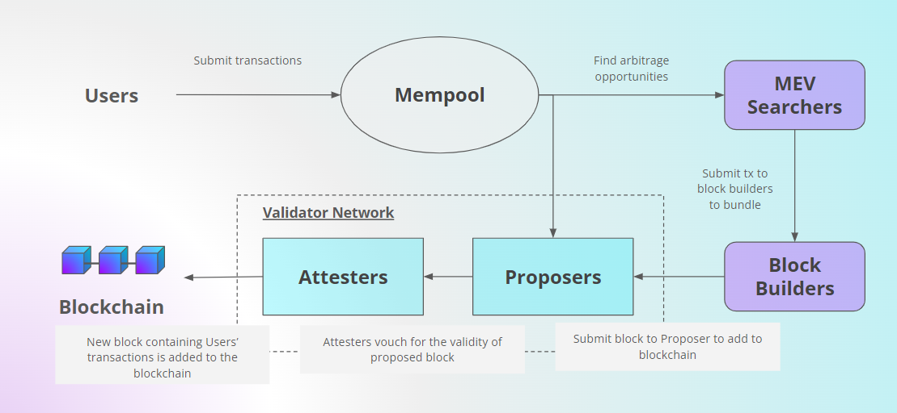

# Preparing your virtual machine

## Create a new VM

Go to your google cloud console and create a new VM.

<figure><figcaption></figcaption></figure>

Use the default settings for the region, zone, and instance type (E2-medium). Change the name of the server if you like.

<figure><figcaption></figcaption></figure>

&#x20;Under **Boot disk**, click on the **"change"** button.

<figure><figcaption></figcaption></figure>

Select `Ubuntu` for the operating system, `Ubuntu 22.04 LTS x86` for the version, `Balanced persistent disk` for the boot disk type, and `32 GB` for the size of the storage.

<figure><figcaption></figcaption></figure>

Once you are done, click on the **"Create"** button at the bottom of the screen.

**Expected output:** You should see your VM instance coming online after loading for a few seconds

<figure><figcaption></figcaption></figure>

&#x20;Click on the dropdown beside the **"SSH"** column and select **"Open in browser window".** Click on **"Authorize"** when prompted.

<figure><figcaption></figcaption></figure>

**Expected output:** Wait for the new window to load and your Ubuntu terminal will appear.

<figure><figcaption></figcaption></figure>
