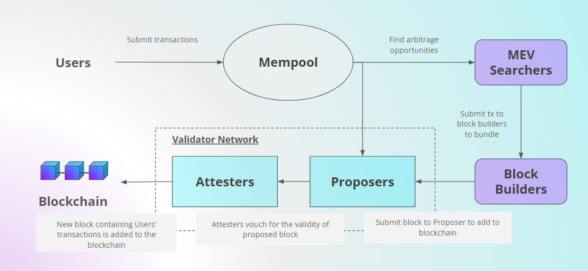

# With external signer (Web3signer)

### Install the dependencies - Java Runtime Environment

```bash
sudo apt install -y default-jre
```

### Install Teku

[Download](https://github.com/ConsenSys/teku/releases) the latest version of Teku and run the checksum verification process to ensure that the downloaded file has not been tampered with.

```bash
cd
curl -LO https://artifacts.consensys.net/public/teku/raw/names/teku.tar.gz/versions/23.6.2/teku-23.6.2.tar.gz
echo "c0b021ead22a514fdb8d5e2ce072549dc447dfdeed660eccef0e3a42890e56c2 teku-23.6.2.tar.gz" | sha256sum --check
```

_**Expected output:** Verify output of the checksum verification._

```
teku-23.6.2.tar.gz: OK
```

If checksum is verified, extract the files and move them into the `(/usr/local/bin)` directory for neatness and best practice. Then, clean up the duplicated copies.

```bash
tar xvf teku-23.6.2.tar.gz
sudo cp -a teku-23.6.2 /usr/local/bin/teku
rm -r teku-23.6.2.tar.gz teku-23.6.2
```

### Configure the beacon node service

_**Note:**_ _We will be running the Beacon Node and Validator client of Teku as separate services so that we can configure a failover node for maximum uptime._

Create an account (`teku`) without server access for the Teku Beacon Node & Validator Client to run as a background service. This restricts potential attackers to only the Teku Beacon Node & Validator Client services in the unlikely event that they manage to infiltrate via a compromised client update.

```bash
sudo useradd --no-create-home --shell /bin/false teku
```

Create a directory for Teku to store the blockchain and validator data of the Consensus layer. Then set the owner of this directory to the `teku` so that this user can read and write to the directory.

```bash
sudo mkdir -p /var/lib/teku
sudo chown -R teku:teku /var/lib/teku
```

Create a systemd configuration file for the Teku Beacon Node service to run in the background.

```bash
sudo nano /etc/systemd/system/tekubeacon.service
```

Paste the configuration parameters below into the file:

```bash
[Unit]
Description=Teku Beacon Node (Mainnet)
Wants=network-online.target
After=network-online.target
[Service]
User=teku
Group=teku
Type=simple
Restart=always
RestartSec=5
Environment="JAVA_OPTS=-Xmx6g"
Environment="TEKU_OPTS=-XX:-HeapDumpOnOutOfMemoryError"
ExecStart=/usr/local/bin/teku/bin/teku \
  --network=mainnet \
  --data-path=/var/lib/teku \
  --ee-endpoint=http://127.0.0.1:8551 \
  --ee-jwt-secret-file=/var/lib/jwtsecret/jwt.hex \
  --initial-state=https://beaconstate.ethstaker.cc \
  --metrics-enabled=true \
  --builder-endpoint=http://127.0.0.1:18550 \
  --rest-api-enabled=true \
  --rest-api-docs-enabled=true \
  --validators-builder-registration-default-enabled=true 

[Install]
WantedBy=multi-user.target
```

Once you're done, save with `Ctrl+O` and `Enter`, then exit with `Ctrl+X`. Understand and review your configuration summary below, and amend if needed.

**Teku Beacon Node configuration summary (WIP):**

`--initial-state` enables nearly instant syncing of the beacon node by pointing to one of the checkpoint sync URLs here - [https://eth-clients.github.io/checkpoint-sync-endpoints/](https://eth-clients.github.io/checkpoint-sync-endpoints/)

### Start the Teku beacon node service

Reload systemd to register the changes made, start the Teku Beacon Node service, and check its status to make sure its running.

```bash
sudo systemctl daemon-reload
sudo systemctl start tekubeacon.service
sudo systemctl status tekubeacon.service
```

**Expected output:** The output should say Teku Beacon Node is **“active (running)”.** Press CTRL-C to exit and Teku Beacon Node will continue to run. It should take just a few minutes for Teku to sync on the Mainnet.

<figure><figcaption><p>sudo systemctl status tekubeacon.service</p></figcaption></figure>

Use the following command to check the logs of Teku Beacon Node’s syncing process. Watch out for any warnings or errors.

```bash
sudo journalctl -fu tekubeacon -o cat | ccze -A
```

**Expected output:**&#x20;

<figure><figcaption><p>This example runs on the goerli testnet. You should see a different initial state URL being printed on the mainnet.</p></figcaption></figure>

Press `Ctrl+C` to exit monitoring.

If the Teku Beacon Node service is running smoothly, we can now enable it to fire up automatically when rebooting the system.

```bash
sudo systemctl enable tekubeacon.service
```

### Verify the Initial State roots (Checkpoint Sync)

1. Go to [beaconcha.in](https://beaconcha.in/) on your browser and search for the slot number (`slot`).&#x20;
2.  &#x20;Verify the `Block Root` and `State Roo`t with your `journalctl` output

    <figure><figcaption><p>testnet example: prater.beaconcha.in</p></figcaption></figure>

### Configure the validator client service

Create a systemd configuration file for the Teku Validator Client service to run in the background.

```bash
sudo nano /etc/systemd/system/tekuvalidator.service
```

Paste the configuration parameters below into the file:

<pre class="language-bash"><code class="lang-bash">[Unit]
Description=Teku Validator Client (Mainnet)
Wants=network-online.target
After=network-online.target
[Service]
User=teku
Group=teku
Type=simple
Restart=always
RestartSec=5
Environment="JAVA_OPTS=-Xmx6g"
Environment="TEKU_OPTS=-XX:-HeapDumpOnOutOfMemoryError"
ExecStart=/usr/local/bin/teku/bin/teku vc \
  --network=mainnet \
  --data-path=/var/lib/teku \
  --validators-external-signer-public-keys=&#x3C;validator pubkeys> \
  --validators-external-signer-url=https://<a data-footnote-ref href="#user-content-fn-1">&#x3C;external_signer_IP_address></a> \
  --validators-proposer-default-fee-recipient=&#x3C;designated wallet address> \
  --validators-proposer-blinded-blocks-enabled=true\
  --validators-graffiti="&#x3C;yourgraffiti>" \
  --metrics-enabled=true \
  --doppelganger-detection-enabled=true \
#  --rest-api-enabled=true

[Install]
WantedBy=multi-user.target
</code></pre>

Once you're done, save with `Ctrl+O` and `Enter`, then exit with `Ctrl+X`. Understand and review your configuration summary below, and amend if needed.

**Teku Validator Client configuration summary (WIP):**

### Start the Teku Validator Client service

Reload the systemd daemon to register the changes made, start the Teku Validator Client, and check its status to make sure its running.

```bash
sudo systemctl daemon-reload
sudo systemctl start tekuvalidator.service
sudo systemctl status tekuvalidator.service
```

The output should say the Teku Validator Client is **“active (running)”.** Press CTRL-C to exit and the Teku Validator Client will continue to run.

Use the following command to check the logs for any warnings or errors:

```bash
sudo journalctl -fu tekuvalidator -o cat | ccze -A
```

**Expected output:**

<figure><figcaption></figcaption></figure>

Press `CTRL-C` to exit.

If the Teku Validator Client service is running smoothly, we can now enable it to fire up automatically when rebooting the system.

```bash
sudo systemctl enable tekuvalidator
```

**Expected output:**

```
Created symlink /etc/systemd/system/multi-user.target.wants/tekuvalidator.service → /etc/systemd/system/tekuvalidator.service.
```

[^1]: 
