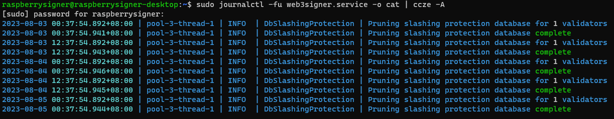

# Updating Web3signer

Log in to the external signer VM.

Check on the status of the Web3signer service for any errors.

```bash
sudo journalctl -fu web3signer.service -o cat | ccze -A
```

_**Expected output:**_



If the Web3signer service is running smoothly, allow outgoing access on the Ubuntu OS firewall to get internet access:

```bash
sudo ufw default allow outgoing
```

Run updates for the general OS and PostgreSQL:

```bash
sudo apt update -y && sudo apt upgrade -y
```

Download the latest version of Web3signer [here](https://github.com/ConsenSys/web3signer/releases) and verify the checksum.

```bash
curl -LO <https://artifacts.consensys.net/public/web3signer/raw/names/web3signer.tar.gz/versions/23.6.0/web3signer-23.6.0.tar.gz>
echo "250c91e7fa18ae9d4962b083a95a7018775a6b99991f1423ce99ffef0366d4a5 web3signer-23.6.0.tar.gz" | sha256sum --check
```

_**Expected output:** If checksum is valid, you will see the following output._

```bash
web3signer-23.6.0.tar.gz: OK
```

If the checksum of the downloaded zipped file is verified, extract the contents into `/usr/local/bin`

```bash
sudo systemctl stop web3signer.service
sudo tar xvf web3signer-23.6.0.tar.gz -C /usr/local/bin
```

Edit the Web3signer configuration file to point to this newer version:

```bash
sudo nano /etc/systemd/system/web3signer.service
```

Change the Web3signer version in the `ExecStart=` line to reflect the latest downloaded version - eg.

```bash
[Unit]
Description=Web3signer
After=network.target

[Service]
User=postgres
Group=postgres
Type=simple
Restart=always
RestartSec=5
ExecStart=/usr/local/bin/web3signer-23.6.0/bin/web3signer \
  --http-listen-host=<Signer_internal_IP> \
  --http-listen-port=9000 \
  --http-host-allowlist=<Signer_internal_IP> \
  --key-store-path=/var/lib/postgresql/web3signer_config/ \
  eth2 \
  --network=mainnet \
  --slashing-protection-db-url="jdbc:postgresql://localhost/web3signer" \
  --slashing-protection-db-username=postgres \
  --slashing-protection-db-password=<postgres_user_password> \
  --slashing-protection-pruning-enabled=true
  
[Install]
WantedBy=multi-user.target
```

Press `CTRL+O`, `ENTER`, and then `CTRL+X` to save and close configuration file.

Reload the configurations and restart the Web3signer service. Then monitor the logs for any errors:

```bash
sudo systemctl daemon-reload
sudo systemctl restart web3signer.service
sudo journalctl -fu web3signer -o cat | ccze -A
```

_**Expected output:** The output should say `Web3Signer has started with TLS disabled, and ready to handle signing requests on <Signer_internal_IP_address>:9000` on the last line - eg_.

```bash
Started Web3signer.
2023-06-20 02:47:43.012+08:00 | main | INFO  | Web3SignerApp | Web3Signer has started with args --http-listen-host=10.0.0.10,--http-listen-port=9000,--http-host-allowlist=10.0.0.10,--key-store-path=/var/lib/postgresql/web3signer_config/,eth2,--network=mainnet,--slashing-protection-db-url=jdbc:postgresql://localhost/web3signer,--slashing-protection-db-username=postgres,--slashing-protection-db-password=password,--slashing-protection-pruning-enabled=true
2023-06-20 02:47:43.163+08:00 | main | INFO  | Web3SignerApp | Version = web3signer/v23.6.0/linux-aarch_64/-ubuntu-openjdk64bitservervm-java-11
2023-06-20 02:47:47.863+08:00 | main | INFO  | Eth2SubCommand | Network: mainnet
Spec Name: PHASE0, Fork Epoch: 0, First Slot: 0
Spec Name: ALTAIR, Fork Epoch: 36660, First Slot: 1173120
Spec Name: BELLATRIX, Fork Epoch: 112260, First Slot: 3592320
Spec Name: CAPELLA, Fork Epoch: 162304, First Slot: 5193728
2023-06-20 02:47:48.061+08:00 | main | INFO  | HikariDataSource | HikariPool-1 - Starting...
2023-06-20 02:47:48.903+08:00 | main | INFO  | HikariPool | HikariPool-1 - Added connection org.postgresql.jdbc.PgConnection@70c69586
2023-06-20 02:47:48.919+08:00 | main | INFO  | HikariDataSource | HikariPool-1 - Start completed.
2023-06-20 02:47:50.236+08:00 | main | INFO  | HikariDataSource | HikariPool-2 - Starting...
2023-06-20 02:47:50.286+08:00 | main | INFO  | HikariPool | HikariPool-2 - Added connection org.postgresql.jdbc.PgConnection@6a6c7f42
2023-06-20 02:47:50.287+08:00 | main | INFO  | HikariDataSource | HikariPool-2 - Start completed.
2023-06-20 02:47:51.206+08:00 | pool-2-thread-1 | INFO  | SignerLoader | Loading signer configuration metadata files from /var/lib/postgresql/web3signer_config
2023-06-20 02:47:51.231+08:00 | pool-2-thread-1 | INFO  | SignerLoader | Signer configuration metadata files read in memory 1 in 00:00:00.017
2023-06-20 02:47:51.476+08:00 | pool-2-thread-1 | INFO  | SignerLoader | Converting signing metadata to Artifact Signer using parallel streams ...
2023-06-20 02:47:56.377+08:00 | ForkJoinPool-1-worker-3 | INFO  | teku-status-log | Using portable BLST library.
2023-06-20 02:47:56.431+08:00 | ForkJoinPool-1-worker-3 | INFO  | BLS | BLS: loaded BLST library
2023-06-20 02:47:56.456+08:00 | pool-2-thread-1 | INFO  | SignerLoader | Total Artifact Signer loaded via configuration files: 1
Error count 0
Time Taken: 00:00:05.223.
2023-06-20 02:47:56.781+08:00 | pool-2-thread-1 | INFO  | RegisteredValidators | Validators registered successfully in database:1
2023-06-20 02:47:56.787+08:00 | pool-2-thread-1 | INFO  | DefaultArtifactSignerProvider | Total signers (keys) currently loaded in memory: 1
2023-06-20 02:47:57.287+08:00 | main | INFO  | Runner | Web3Signer has started with TLS disabled, and ready to handle signing requests on 10.0.0.10:9000
```

Use `CTRL + C` to exit the journal logs monitoring.

**Remove the previous version of Web3signer.** _Check the name of the folder to be deleted by running the `ls` command in the `/usr/local/bin` folder if needed_

```bash
cd /usr/local/bin/
sudo rm -r web3signer-23.3.1/
cd
sudo rm -r web3signer-23.6.0 web3signer-23.6.0.tar.gz
```

Prune the journal logs of Web3signer

```bash
sudo journalctl --flush --rotate
sudo journalctl --vacuum-time=1days
```

_**Expected output:**_

```bash
Deleted archived journal /var/log/journal/fc339864596944d5a87fda3c92862030/system@7912e86279ed4cc7adefd07fa4e85f31-000000000093aeb0-0006019eba47eb26.journal (40.0M).
Deleted archived journal /var/log/journal/fc339864596944d5a87fda3c92862030/user-1001@36085c6259254466bda57585c5eaf28c-000000000093aeb2-0006019eba50f754.journal (112.0M).
Deleted archived journal /var/log/journal/fc339864596944d5a87fda3c92862030/user-1000@1404a59e195c4457bac91557b6c0b009-000000000093b8e5-000601a09c715f72.journal (8.0M).
Deleted archived journal /var/log/journal/fc339864596944d5a87fda3c92862030/user-1005@35eae8704ebd46b9879e47d69edec57f-0000000000957607-000601ff1aedab20.journal (48.0M).
Deleted archived journal /var/log/journal/fc339864596944d5a87fda3c92862030/user-1004@c1ac79297176440ab4189beffeba2661-000000000093aeb4-0006019eba674ce5.journal (80.0M).
Vacuuming done, freed 3.9G of archived journals from /var/log/journal/fc339864596944d5a87fda3c92862030.
Vacuuming done, freed 0B of archived journals from /var/log/journal.
```

Then check that the logs are in a good state after

```bash
sudo journalctl --verify
```

_**Expected output:**_

```visual-basic
PASS: /var/log/journal/fc339864596944d5a87fda3c92862030/user-1006.journal                                                                          
PASS: /var/log/journal/fc339864596944d5a87fda3c92862030/user-1007@f3ce06b54d0d4ccfbe813a2a0af5e2b9-0000000000956613-000601fe9aea2f09.journal       
PASS: /var/log/journal/fc339864596944d5a87fda3c92862030/system.journal                                                                             
PASS: /var/log/journal/fc339864596944d5a87fda3c92862030/user-1004.journal                                                                          
PASS: /var/log/journal/fc339864596944d5a87fda3c92862030/user-1005.journal                                                                          
PASS: /var/log/journal/fc339864596944d5a87fda3c92862030/user-1000.journal                                                                          
PASS: /var/log/journal/fc339864596944d5a87fda3c92862030/user-1001.journal                                                                          
PASS: /var/log/journal/fc339864596944d5a87fda3c92862030/user-1007.journal
```

When you are done, remove general outgoing access on Ubuntu firewall and reboot the Signer device:

<pre class="language-bash"><code class="lang-bash"><strong>sudo ufw default deny outgoing
</strong><strong>sudo reboot 0
</strong></code></pre>
